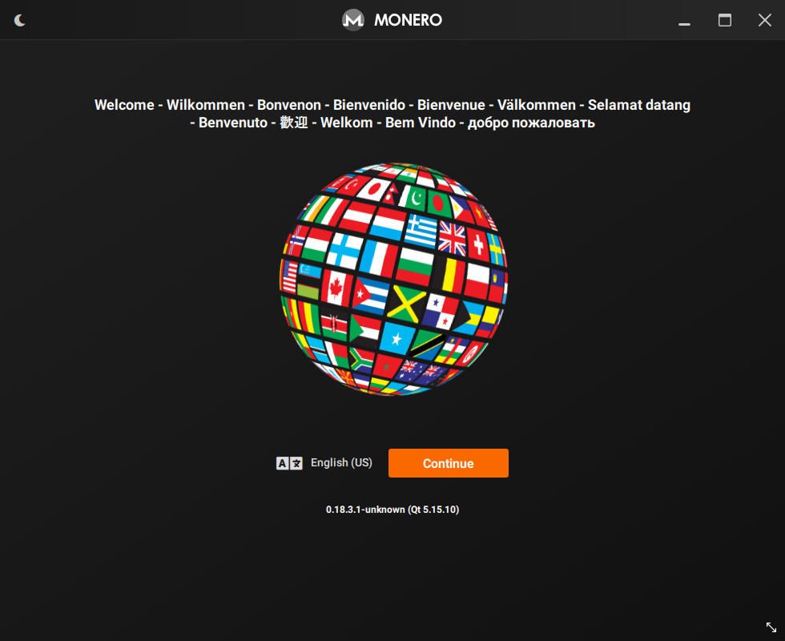
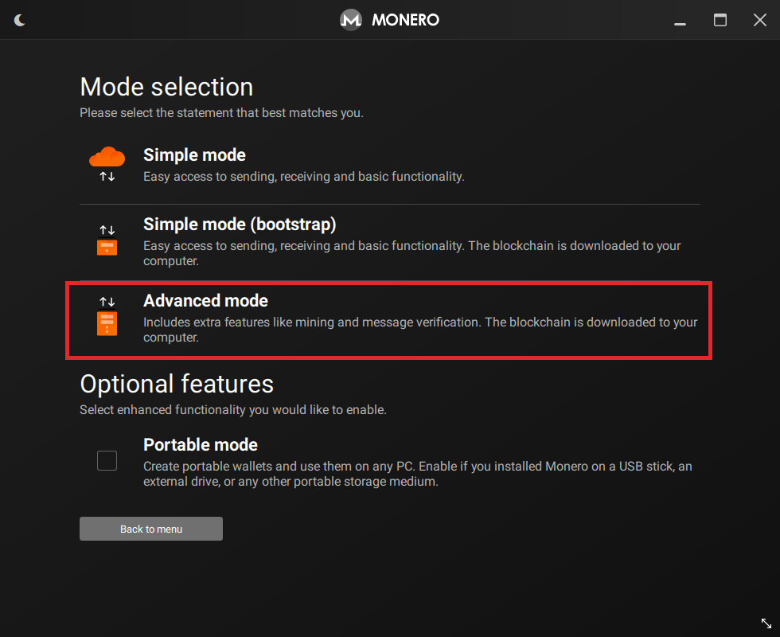
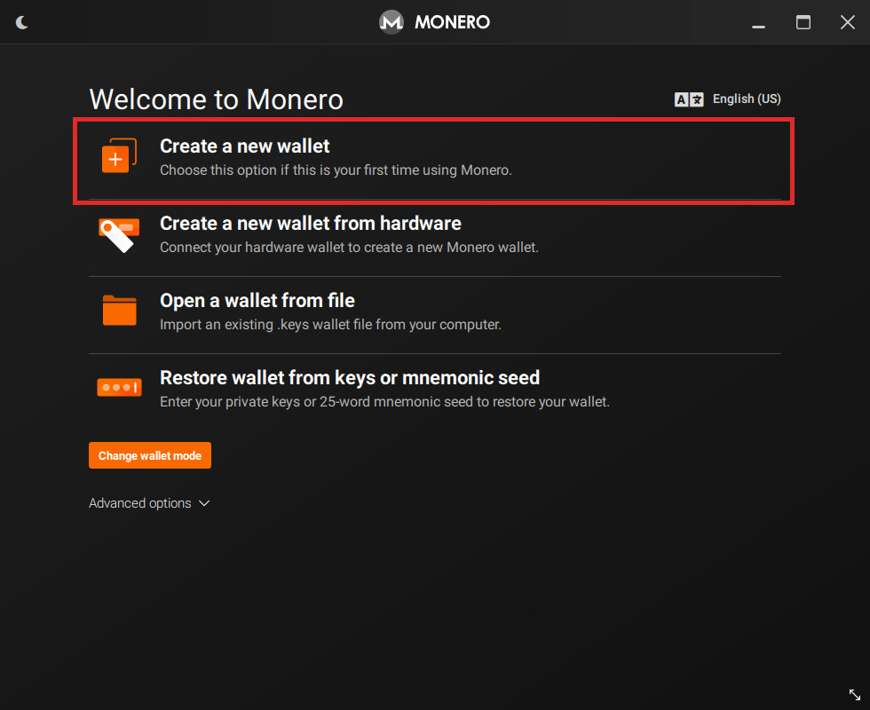
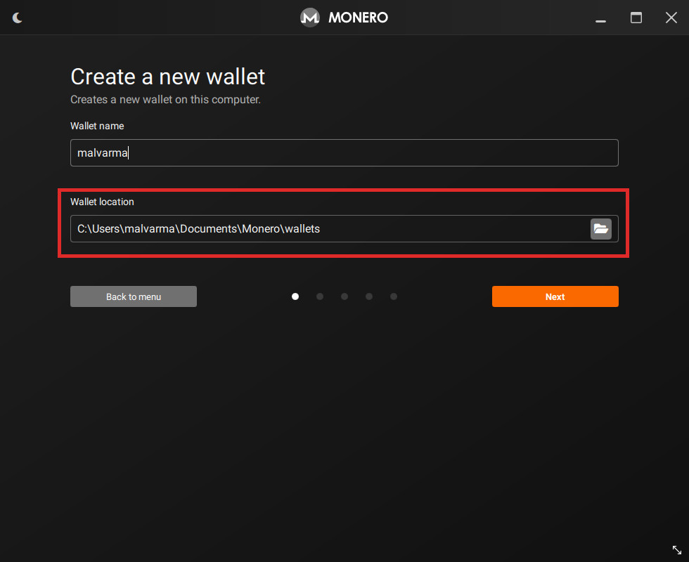
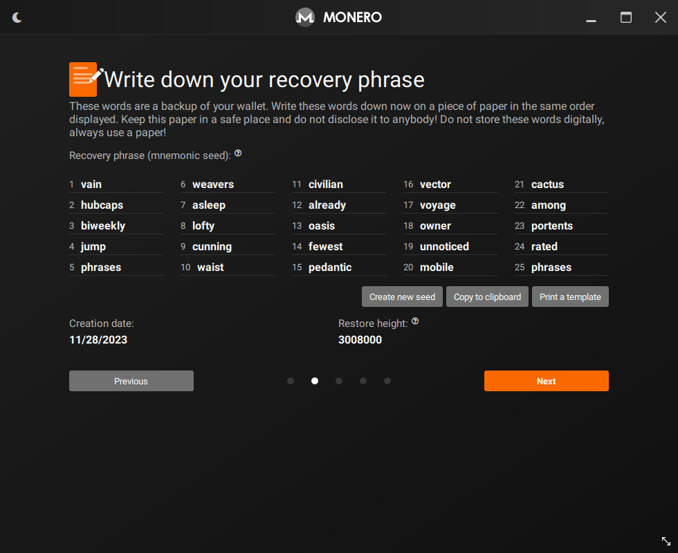
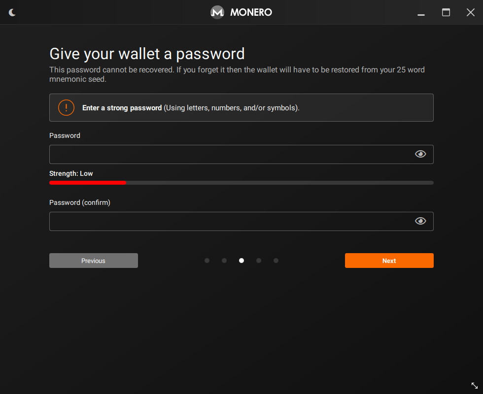
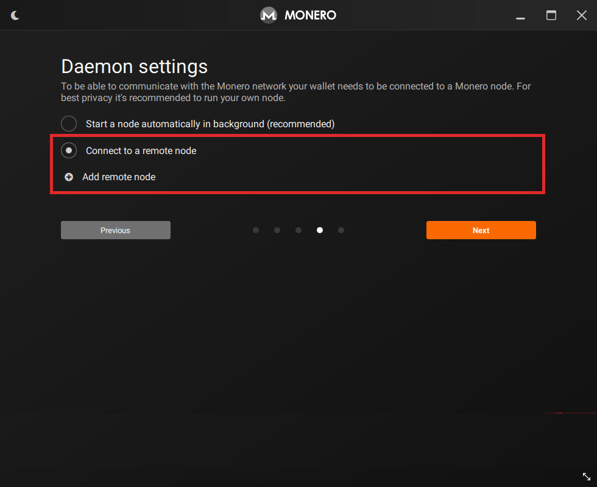
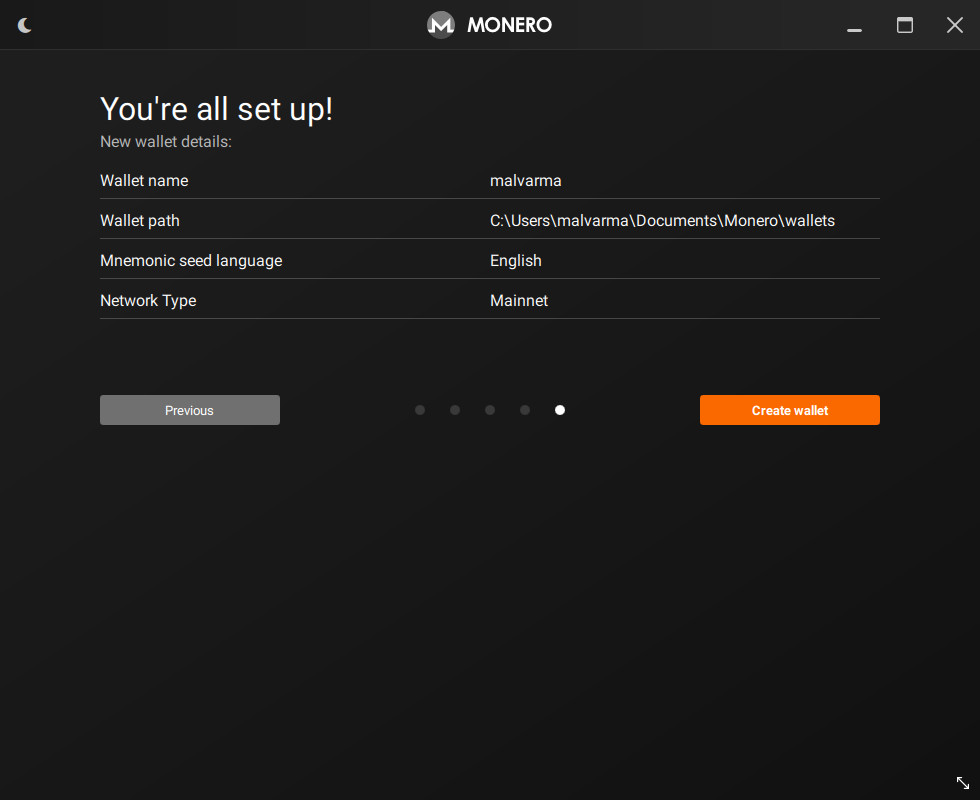
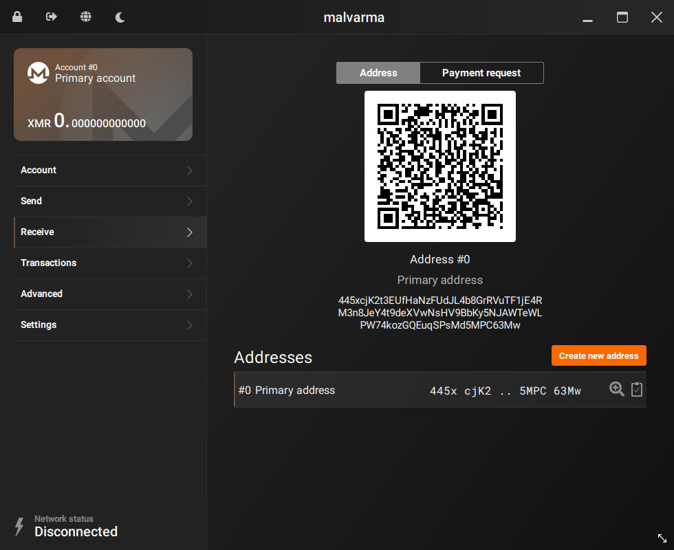

# Create the cold wallet

After booting your newly created air-gapped device, you should confirm that it really <strong>cannot</strong> connect to any network before proceeding.

---

We'll now be going through the standard procedure of making a (cold) wallet with Monero GUI, just follow the steps.

When selecting a mode, be sure to select `Advanced mode`.

This must be selected to enable certain offline transaction functionality.

Now, create your new cold wallet.

Take note of where your wallet is being saved, we'll be looking here later.

You can temporarily write down your seed on paper, but consider reading [`Backup the cold wallet`](../optional/backup_the_cold_wallet.md) to see how to backup your wallet digitally.

The gist is that the seed should never see the internet or any other device unencrypted.

Optionally create a wallet password.

Depending on your [threat model](https://en.wikipedia.org/wiki/Threat_model), a password may not be necessary as this device will be offline forever. The likelihood of you losing this password may be higher than a successful attack occurring to an air-gapped machine.

When selecting a node, select `Connect to a remote node` and do not add anything.

This wallet is offline, so we'll never be starting a Monero node.

Confirm your wallet looks correct, then create!

Now, we have a cold wallet on a cold device - **this wallet must never leave this device** (at least, unencrypted).

The QR Code and Monero address shown would be your cold wallets address.

This is the address you can send to people when you want to receive Monero (or, a secondary address via `Create new address`).

This wallet can **sign** transactions, however, since it is offline, it cannot actually send them to the Monero network to be processed. It cannot even create them in the first place.

To address this, let's continue to the next step: [`Create the view wallet`](./create_the_view_wallet.md).

