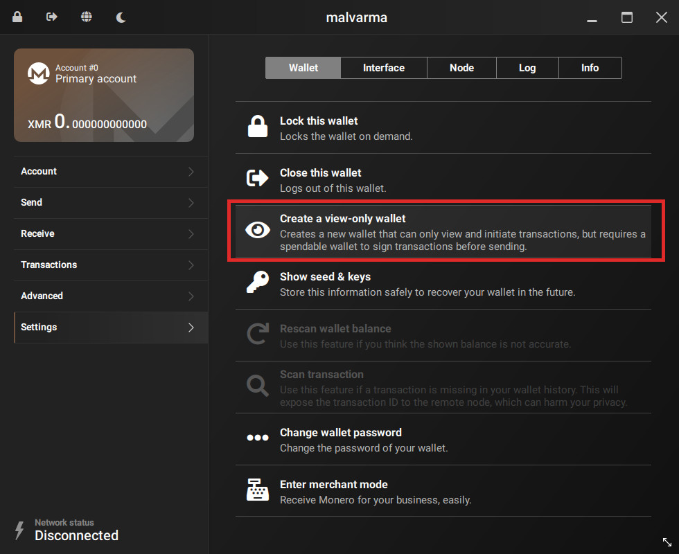
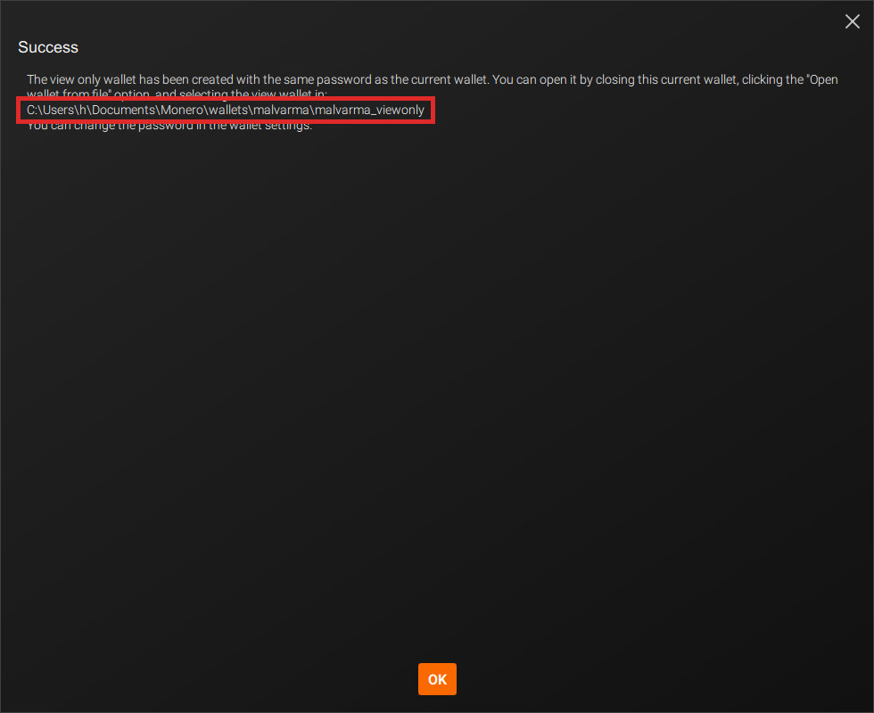
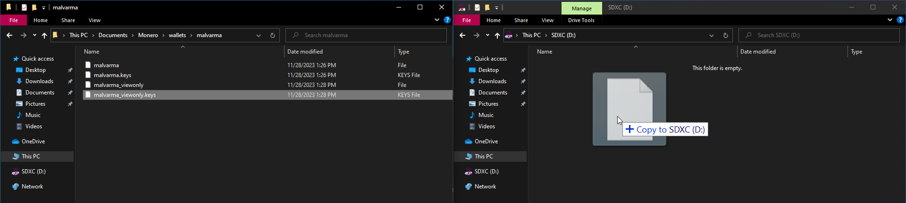
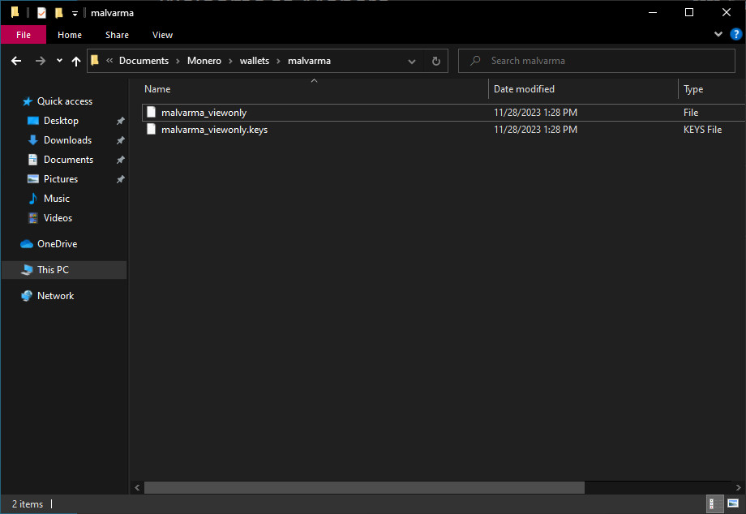
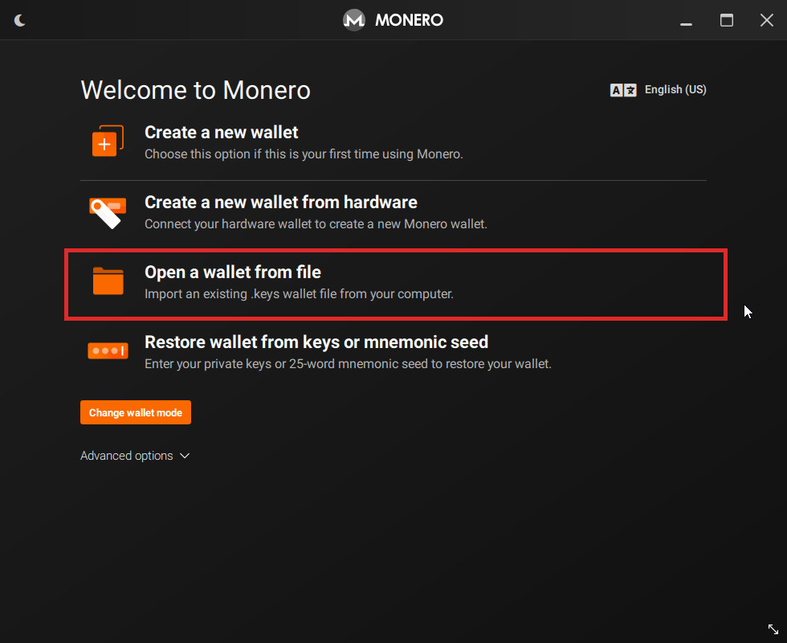
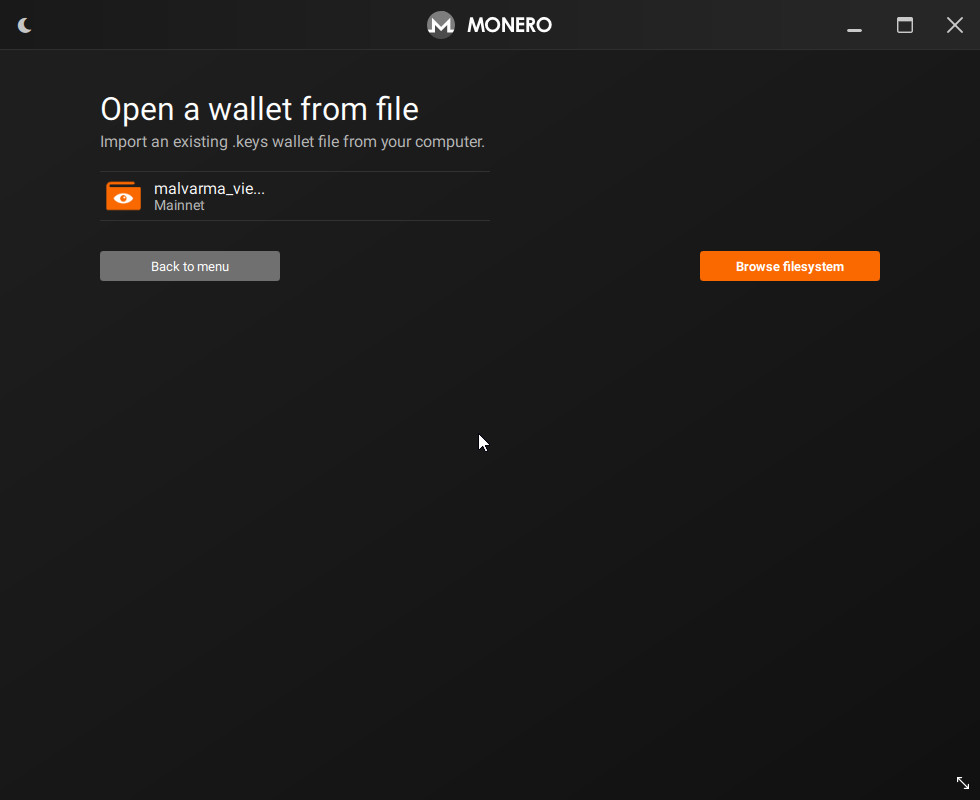
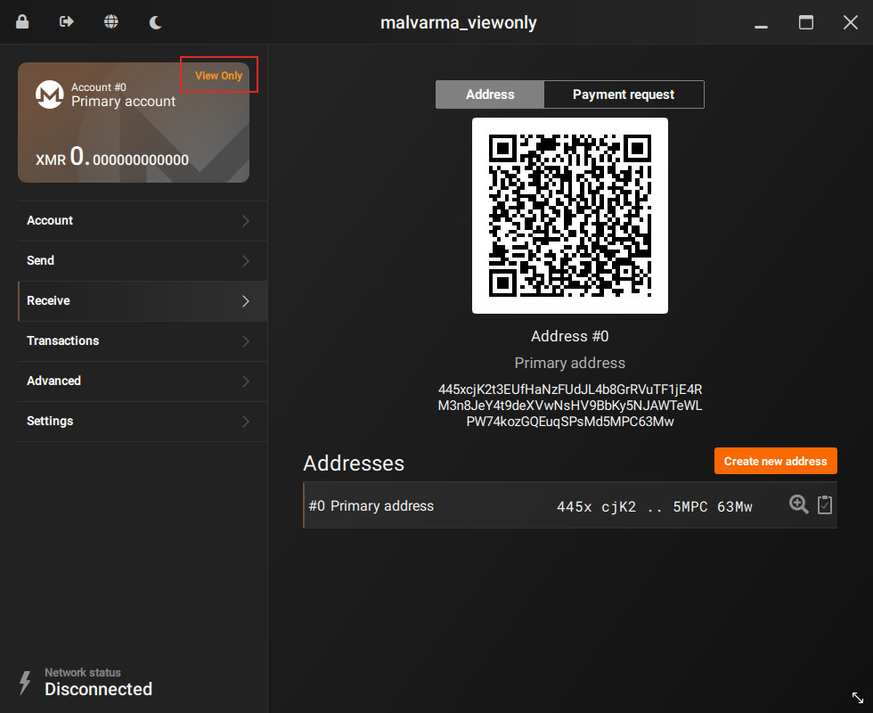
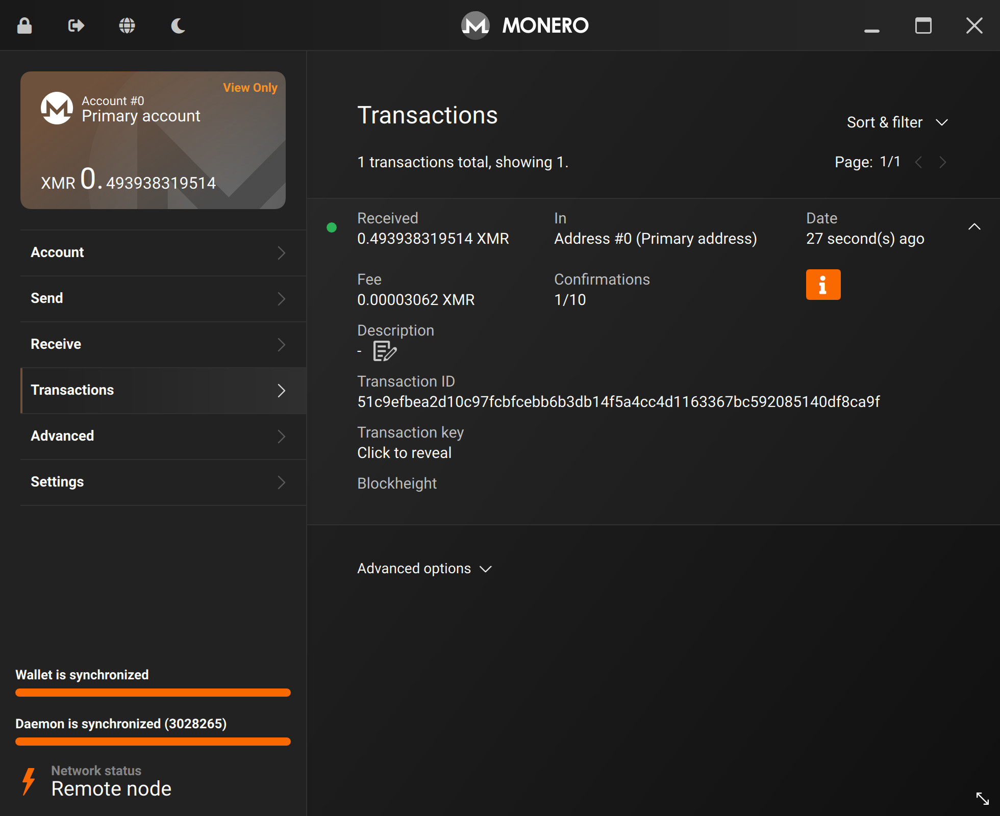

# Create the view wallet
Now that you've created your cold wallet, you're now going to create a corresponding `view-only` wallet. This wallet is linked to your cold wallet (same address), but it has some notable properties.

This `view-only` wallet can:
- See incoming transactions
- Create transactions

but is **not** allowed to sign transactions (aka, spend funds).

This `view-only` wallet can be placed on a "hot" machine, and you can be more relaxed with it, as it cannot spend funds.

## 👁 Creating the `view-only` wallet

In your cold wallet, goto:
- Settings
- Wallet

and click `Create a view-only wallet`.



Take note of where the new `view-only` wallet is saved.



Go to the location of where your `view-only` wallet is saved.

On Windows, by default it is:
```
C:\Users\COLD_COMPUTER\Documents\Monero\wallets\YOUR_WALLET\YOUR_WALLET_viewonly
```

Now, plug in your data transfer medium of choice (USB, SD Card, etc), and copy the **view-only** wallet over.

**Only the view-only wallet.**

There will be a normal file (`malvarma_viewonly` in the picture) and a corresponding `.keys` version, only the `.keys` version is required but you can copy both.



## 📥 Importing the `view-only` wallet

Stepping away from the cold device - we're now switching over to your `view-only` device (maybe the computer you're using to read this guide?)

Plug in your data transfer medium of choice, import the `view-only` wallet files.



The `view-only` wallet files should be placed where your Monero GUI looks for wallet files, again by default this is in:
```
C:\Users\HOT_COMPUTER\Documents\Monero\wallets\YOUR_WALLET
```
If you don't know where Monero GUI looks for wallet files, that's fine, it will allow you to select them in the next step.

Import the `view-only` wallet by selecting `Open a wallet from file`.



There's our `view-only` wallet, select it and open.



You now have a `view-only` wallet version of your cold wallet!

Make sure the address is the same as your cold wallet.

Note that in the top-left corner, a `View Only` marker appears.

From now on, if you're ever confused on which wallet we're dealing with in the guide, look for the `View Only` marker.

## ⏳ Syncing the `view-only` wallet

To view funds sent to this wallet, you'll be syncing this `view-only` wallet just like you would for a regular wallet.



Fast forward some amount of time.

We've received some funds, and we can see it after syncing the `view-only` wallet.

But, we can't spend it.

To address this, let's continue to the next chapter: [`Transactions`](../transactions/transactions.md).


