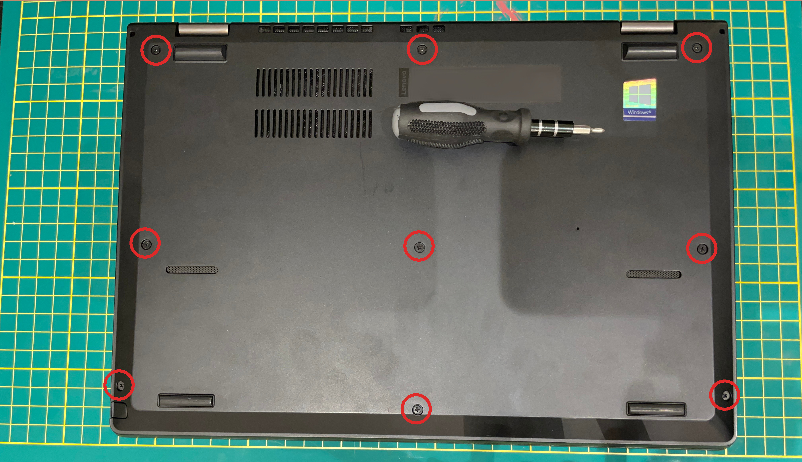
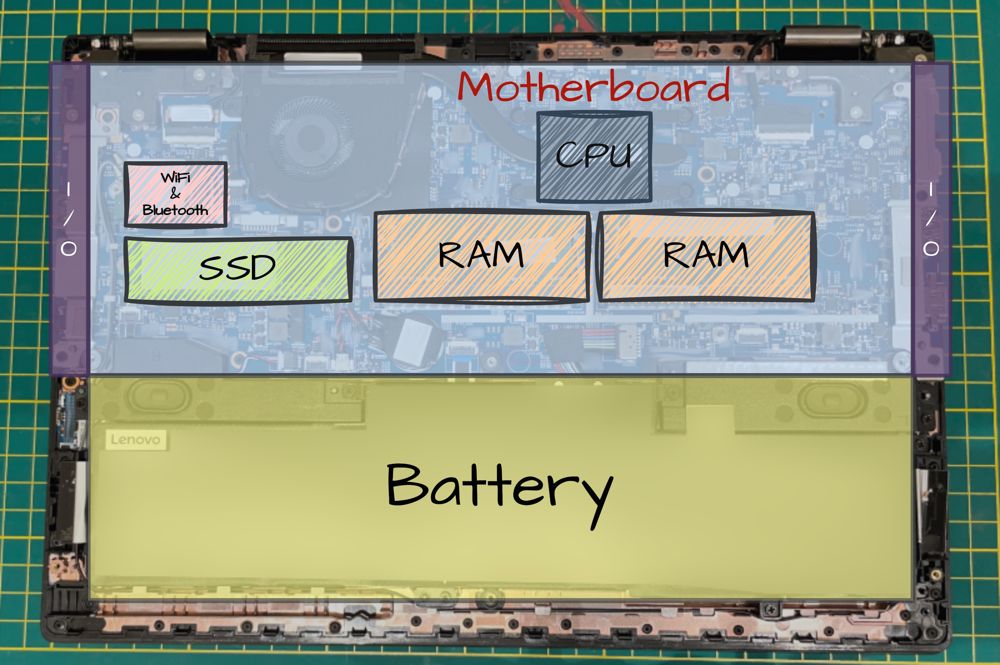
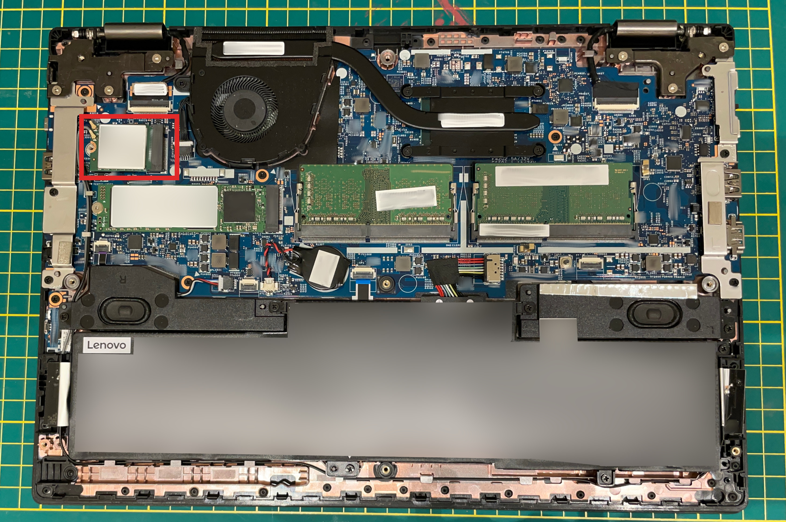
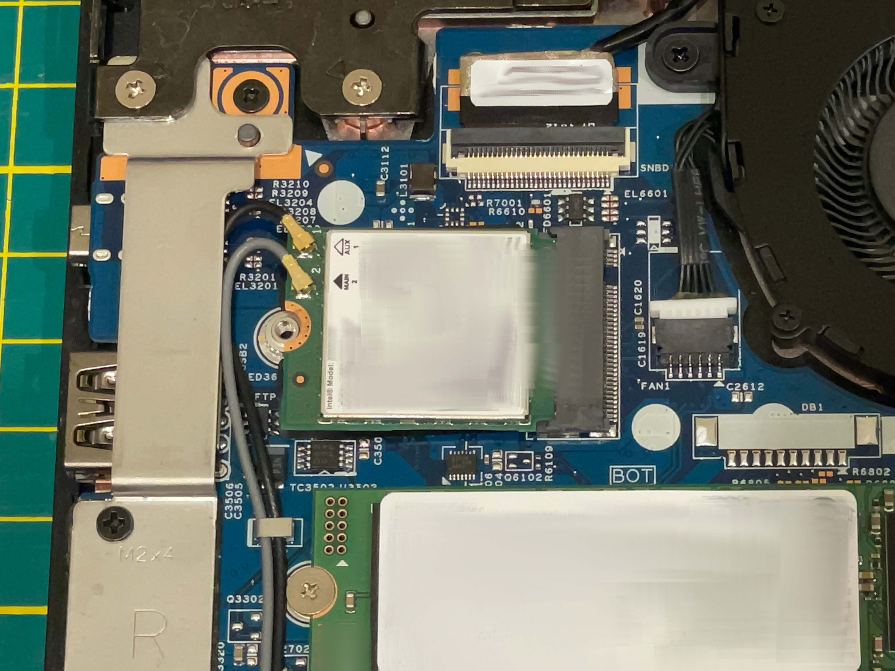
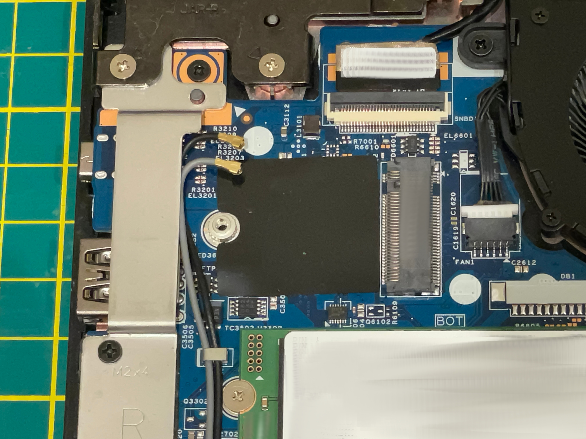
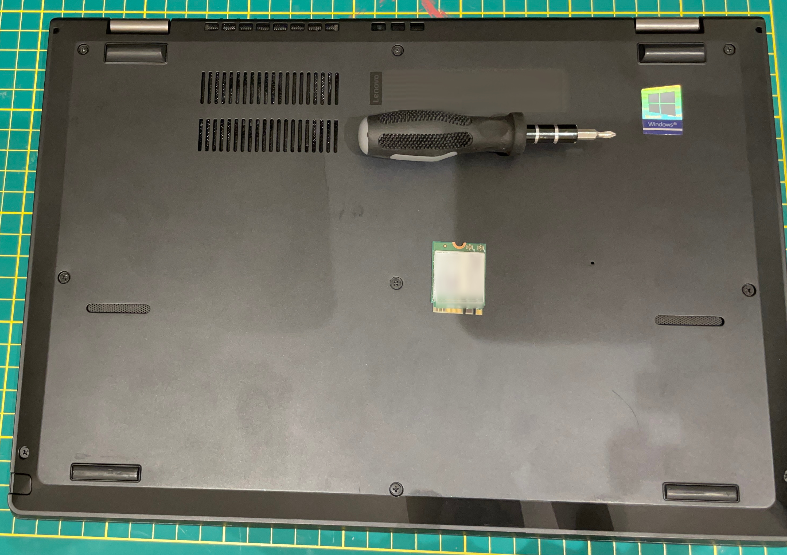

# Prepare the hardware
Now that all the software that you'll need is installed, this step will prepare the hardware such that it physically cannot connect to any network (at least, wirelessly).

If this step is not applicable to your hardware (Desktop, SBC, etc) you can skip this step, although be aware that your computer will still have the _physical_ ability to create internet connections.

In that case, using a motherboard or SBC without an integrated WiFi and/or Bluetooth chip would be equivalent to this step.

## 👋 Goodbye, WiFi
We're going to be removing the WiFi/Bluetooth chip from the example laptop.

Be sure to turn off the laptop and unplug any power.

Most cheap laptops like this will have 9-12 screws on the back, yours may differ slightly, but in the end it's the same - unscrew the back cover and open it up.

After unscrewing, there are most likely plastic clips locking the back cover into place, so you will have to pry the cover open - don't be scared!

Almost all laptops like this have the same general internal structure.

Although, we are only interested in the WiFi/Bluetooth chip.

This is almost always a **single, square-shaped chip - located in the top-left corner**.

Most of these chips are produced by `Intel`.

There will be 2 unique-looking wires connected to the chip.

1. Unplug the wires
2. Unscrew the (usually single) screw holding the chip in place
3. Simply pull out the chip

Now your device is physically incapable of making internet/bluetooth connections. [^1]

You can now close the back cover, and do whatever you want with the chip.

Congratulations, you now have an air-gapped laptop.

[^1]: USB WiFi/Bluetooth adapters exist, your laptop may still have an ethernet port, etc - this is addressed in [Physical security](../optional/physical_security.md)
