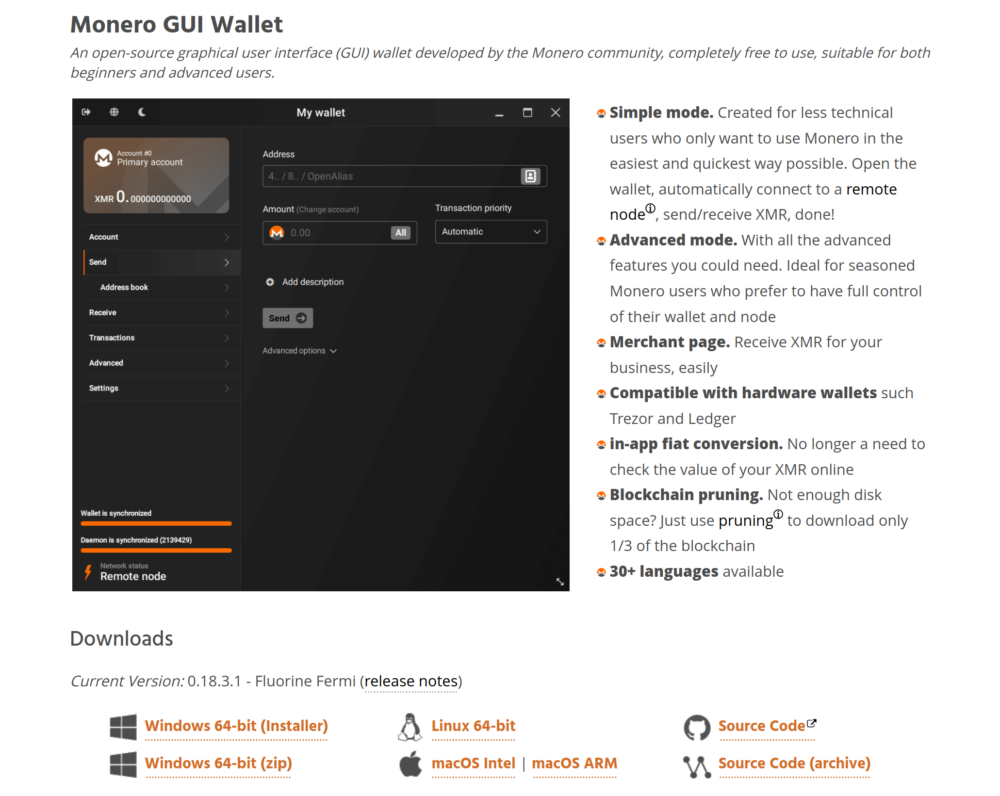
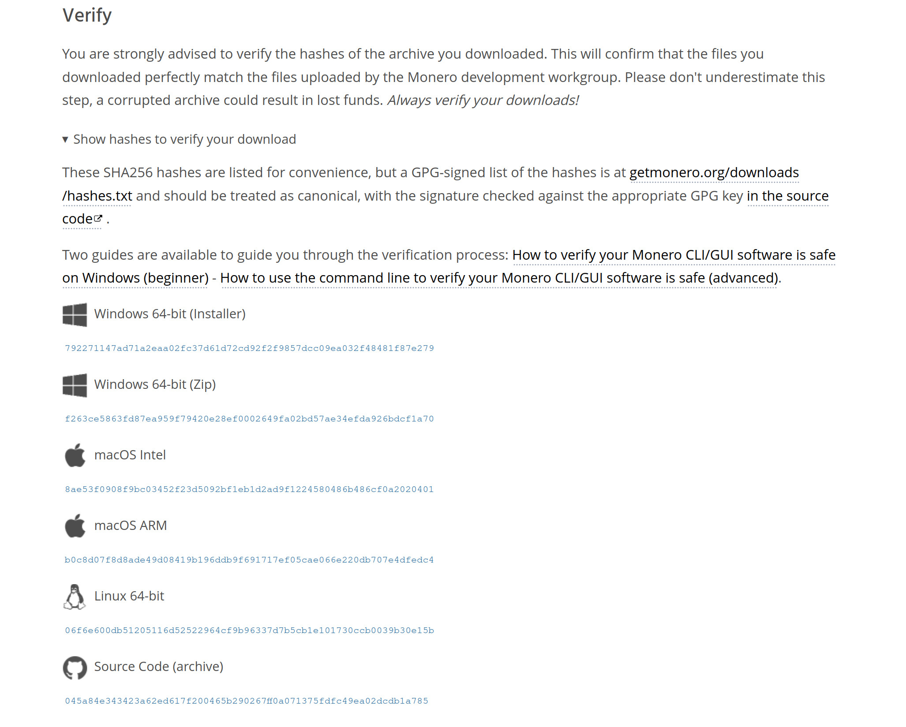

# Prepare the software
In the next few steps we'll be taking our device offline _forever_, so we'll be making sure that we have _everything_ we need installed here, beforehand.

Most notably, we need wallet software - we'll be using [Monero GUI](https://www.getmonero.org/downloads) in this guide.

Other wallets that support offline transactions can be used (e.g Monero CLI) however the steps may slightly differ.

---

## 💾 Install

Make sure your wallet software is installed on your cold device.

If you are using the cold device for purposes [in addition to Monero](../before_we_start/before_we_start.md), you should make that software is installed as well.

If [full disk encryption](../optional/physical_security.md) is desired, that step should be done before any of this as well (you cannot easily do this after the fact).

## 🔏 Verify

While this last step is technically optional, you are strongly encouraged to verify your wallet's authenticity before usage.

There are steps specific to Monero GUI [here](https://web.getmonero.org/resources/user-guides/verification-windows-beginner.html). More details can be found on the [downloads](https://getmonero.org/downloads) page.

