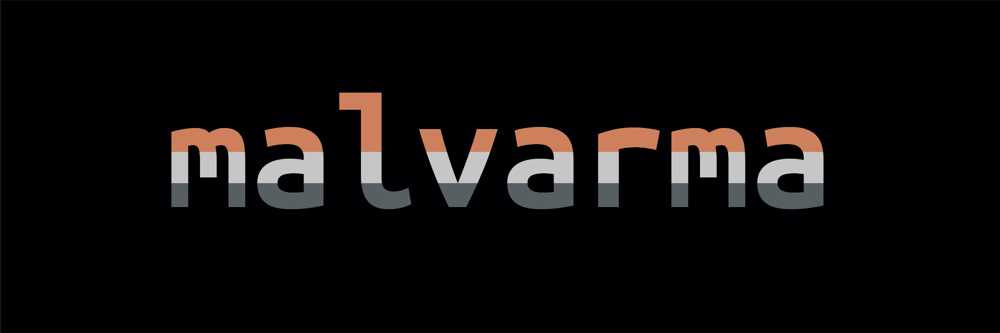

Malvarma is a [cold wallet](https://en.wikipedia.org/wiki/Cryptocurrency_wallet#Cold_storage) guide for [Monero](https://getmonero.org).

---

This guide hand-holds you through:
1. Creating an [air-gapped](https://en.wikipedia.org/wiki/Air_gap_(networking)) device
2. Creating a cold/view Monero wallet pair
3. Creating, signing, and broadcasting a cold Monero transaction

The entire process can be finished anywhere from 1 hour to 1 day, depending on experience.

---

Continue to the first step by clicking `>` or by selecting the next chapter: [`Before we start`](./before_we_start/before_we_start.md).

All chapters are viewable by clicking the top-left `☰` button.
