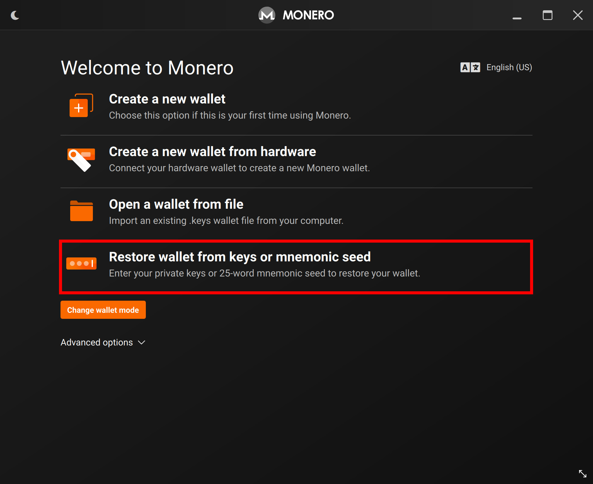
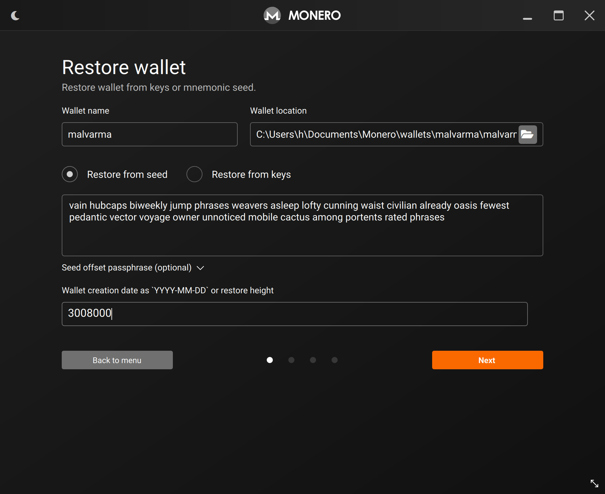
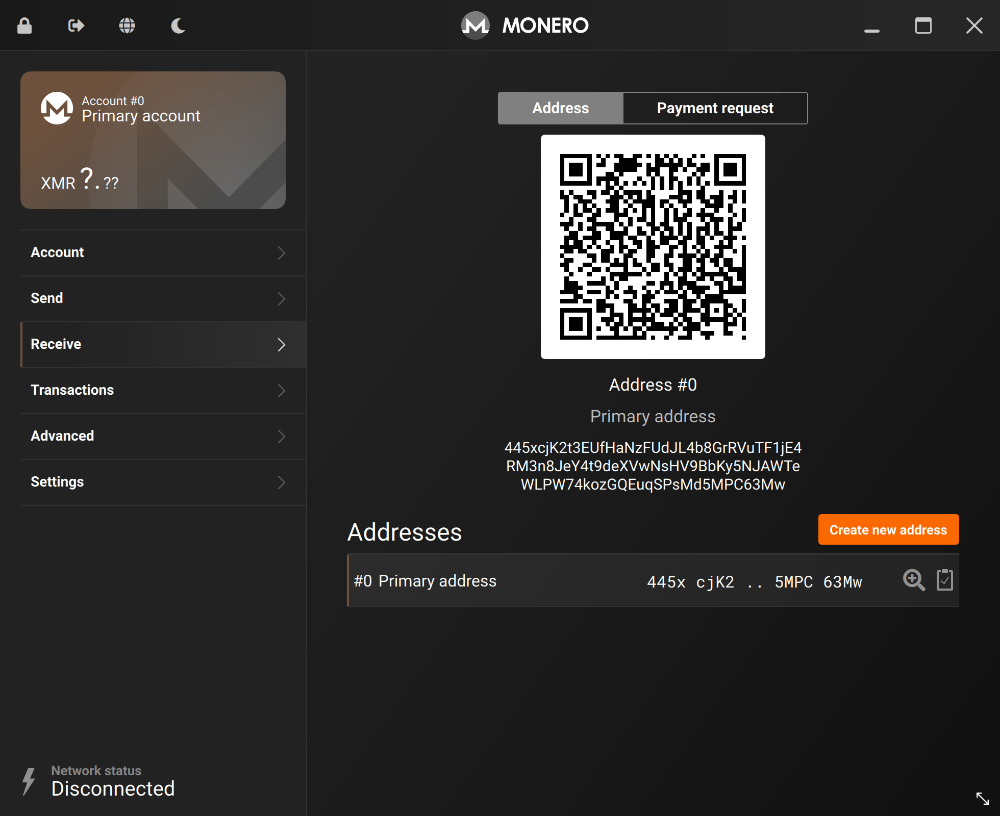

# Restoring from the seed
In the case that you only have the cold wallet's seed phrase for recovery, you will have to:
- Recover the cold wallet
- Recreate the `view-only` wallet
- Exchange outputs and key images

All the steps here are laid out in other chapters, we will be repeating them.

---

## 📎 Recovering the cold wallet

Be sure only recover your cold wallet on a properly air-gapped device.

On your air-gapped device, go through the standard procedure of creating a Monero wallet, this time selecting `Restore wallet from keys or mnemonic seed`.

Enter your seed phrase and re-create the cold wallet.

Password and node prompts will show.

Like in [`Create the cold wallet`](../cold_wallet/create_the_cold_wallet.md), it is up to you to choose a password or not.

For the node connection, select `Connect to a remote node` and do not add anything.

After creation, confirm that your wallet address is correct.

## 🖇 Recreating the `view-only` wallet
You can follow the exact same steps in [`Create the view wallet`](../cold_wallet/create_the_view_wallet.md) to re-create your `view-only` wallet.

After you have successfully recovered both the cold & `view-only` wallet, continue to the next step.

## 📤📥 Outputs and Key Images
We'll now be transferring [two additional pieces of data](../before_we_start/what_things_mean.md#-key-images--outputs) to update both our cold and `view-only` wallet's balances.

Starting from your `view-only` wallet, follow the steps in [`Outputs`](../transactions/outputs.md), transferring the `outputs` file from your `view-only` wallet to your **cold wallet**.

On your cold wallet, import the `outputs` file.

Now, for the `Key Images` - follow the steps in [`Restoring the view wallet`](./restoring_the_view_wallet.md), transferring the `Key Images` file from your **cold wallet** to your `view-only` wallet.

Both wallets should now have up-to-date balances, you can now [start creating and signing transactions again](../transactions/transactions.md).
