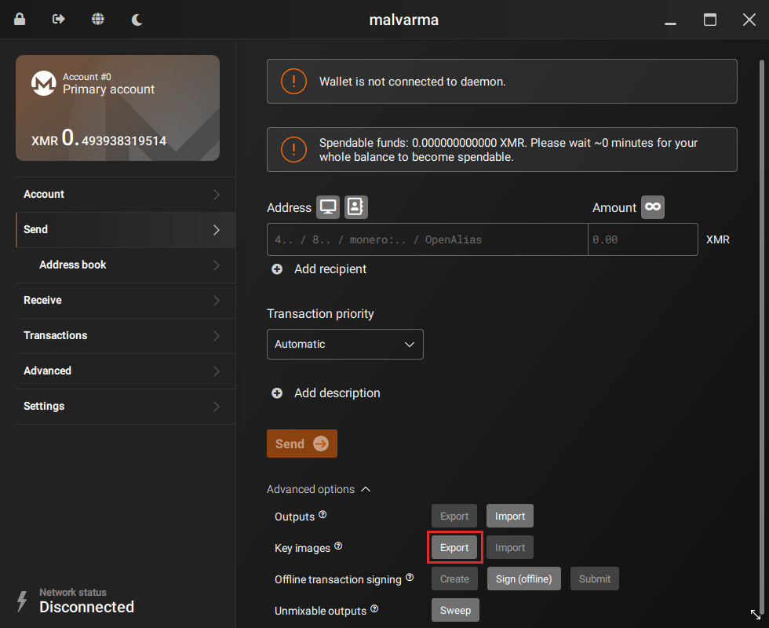
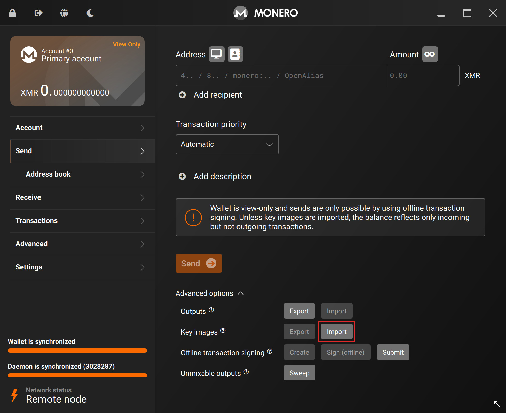

# Restoring the view wallet
If you are restoring your `view-only` wallet on a new machine, you must import the `Key images` briefly mentioned in [`Broadcast the transaction`](../transactions/broadcast_the_transaction.md) once again, such that your `view-only` wallet can see the amount of funds it _has already_ spent (thus, an updated balance).

---

In your cold wallet, goto:
- `Send` tab
- Advanced options
- Key images
- Click `Export`

You will be asked to pick a location to save this `Key images` file.

Transfer the `Key images` file to your data transfer medium.

After plugging in your data transfer medium into your `view-only` machine, goto:
- `Send` tab
- Advanced options
- Key images
- Click `Import`

and select the `Key images` file you just created.

Your `view-only` wallet should now see an updated balance.

