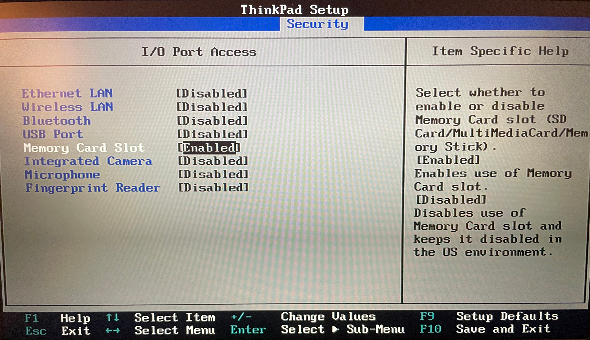

# Physical security

## ❌ Disable auto-run
Many OS's (including Windows, Ubuntu) have an "auto-run" feature enabled by default.

This allows data transfer devices such as USB & SD cards to automatically run executable files when plugged in.

There is relatively rare malware that can abuse this - in this guides case, it is one of the few remaining ways your air-gapped machine could be compromised.

This is usually as simple as unclicking a toggle box, [see here for Windows](https://www.nucleustechnologies.com/blog/three-methods-to-disable-autorun-in-windows-10) and [here for Ubuntu (or any Linux using GNOME)](https://wiki.ubuntu.com/autorun).

## 📝 Configure the BIOS
Your air-gapped machine's BIOS most likely has options to disable some hardware components.

This is a much more practical way to "disable" hardware compared to physically ripping out an ethernet jack.

You can disable any I/O that will no longer be used, e.g Ethernet, other USB ports, etc.

## 🔐 Disk encryption
At-rest disk encryption on your air-gapped machine defends against physical compromises (depending on your password/key's strength).

As suggested in [`Create the cold wallet`](../cold_wallet/create_the_cold_wallet.md), the likelihood of you losing the encryption password should be weighted against the likelihood of your machine actually being physically compromised, you _most likely_ do not need this step, but if you do, you know who you are.

---

This step must be done before creating your air-gapped machine, before [`Prepare the software`](../cold_wallet/prepare_the_software.md).

[See here for Windows](https://support.microsoft.com/en-us/windows/turn-on-device-encryption-0c453637-bc88-5f74-5105-741561aae838) and [here for Linux](https://en.wikipedia.org/wiki/Linux_Unified_Key_Setup).

The process for Linux will differ slightly per distribution, but LUKS is the scheme used in most setups.

## 🔌 Misc ports
Your air-gapped machine may or may not have usable USB ports (that `USB WiFi` dongles could be plugged into) and/or Ethernet ports.

**Do not plug anything into them.**
