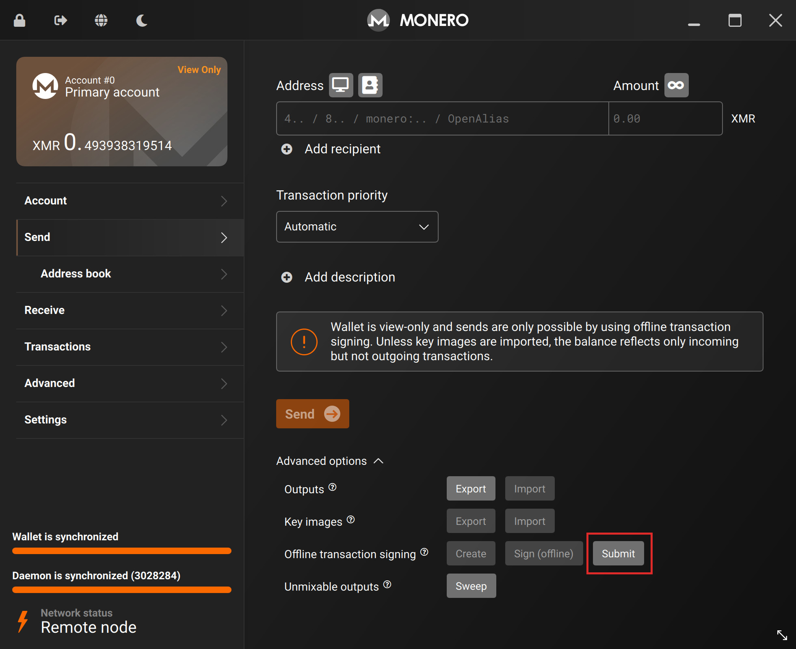
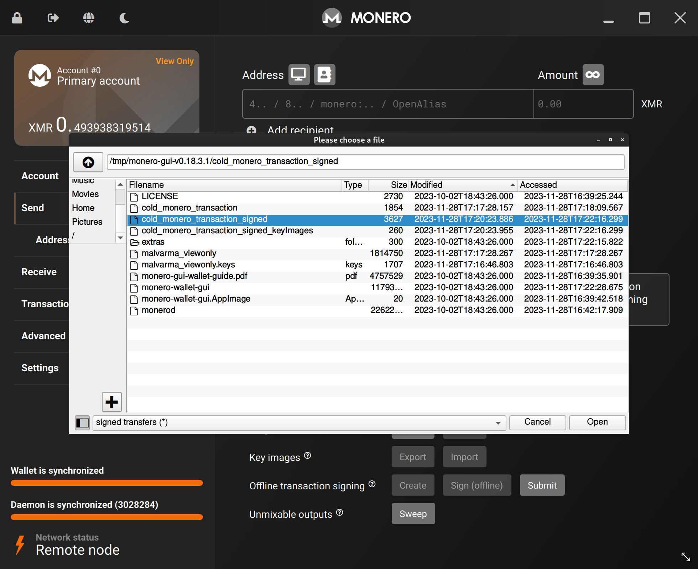
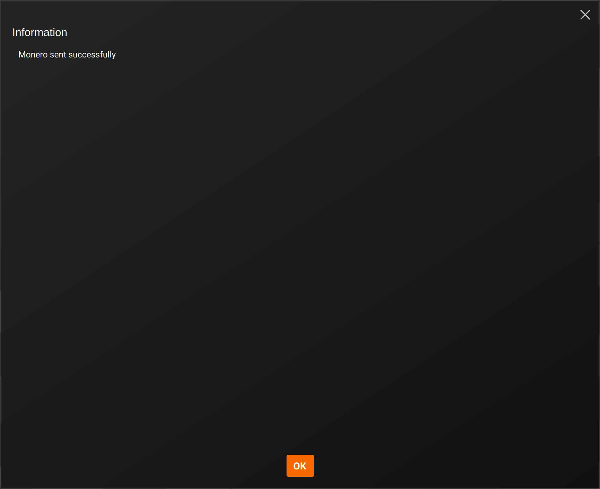
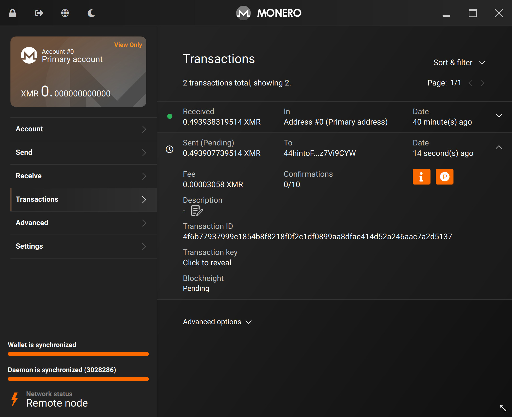
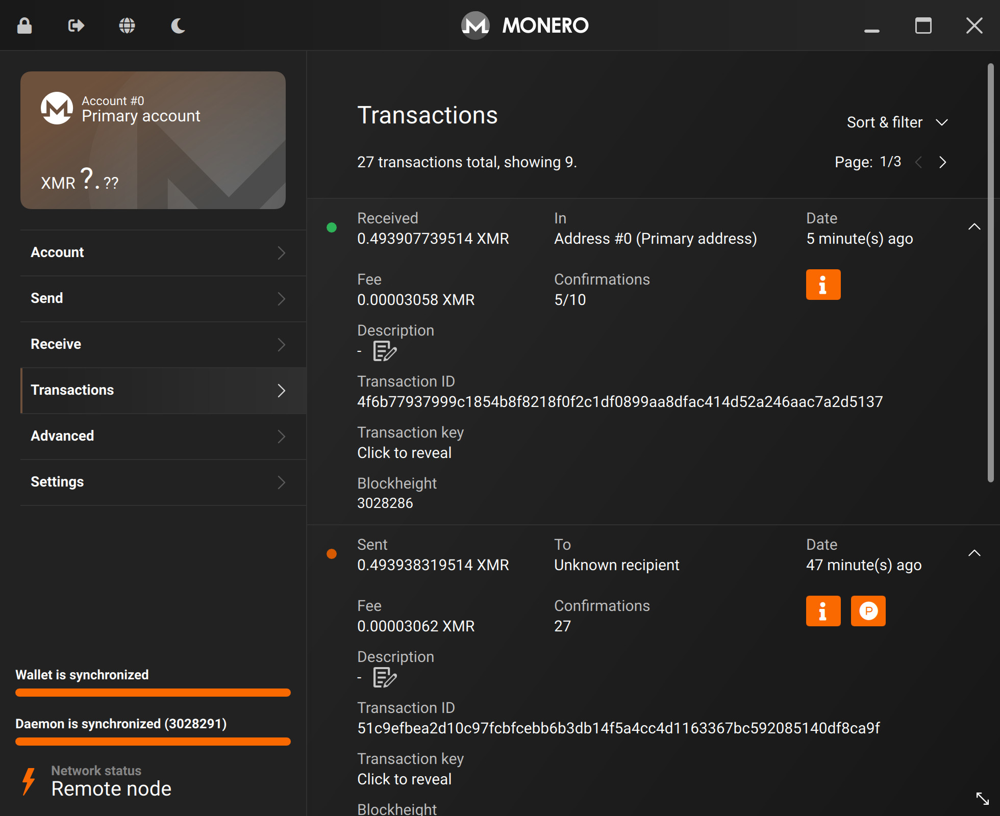

# Broadcast the transaction
We'll now be broadcasting our transaction we created in the previous step.

It is signed, thus the network knows that we "authorized" it, and will accept it like a normal transaction.

---

Back on the `view-only` wallet.

Goto:
- `Send` tab
- Advanced options
- Offline transaction signing
- Click `Submit`

Find the `_signed` version of your transaction on your data transfer medium, and select it.

If the `_signed_keyImages` file is in the same folder, Monero GUI will automatically import that as well.

If it is not, you will have to manually use the:
- `Send` tab
- Advanced options
- Key images
- `Import`

feature to import the file. This is required.

The wallet has accepted the signed transaction file, and our money was successfully sent!

We can see in our `view-only` wallet that we've sent the money to `44hinto...7Vi9CYW`.

Sometime later, the actual `44hinto...7Vi9CYW` wallet will receive the money, as seen below.

Congratulations, you've successfully created, signed, and broadcasted a cold Monero transaction!

There's only 1 step left: [`Outputs`](outputs.md).

