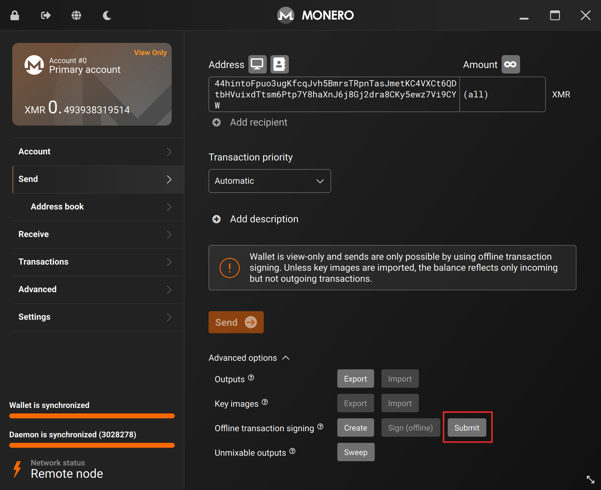
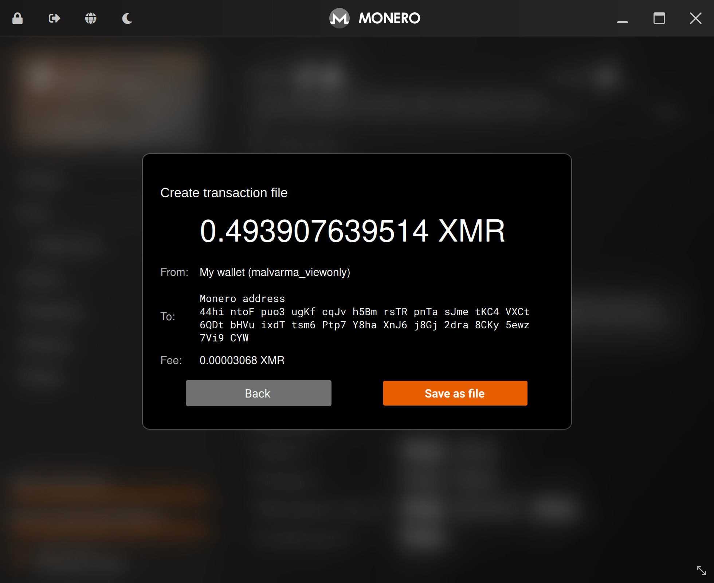
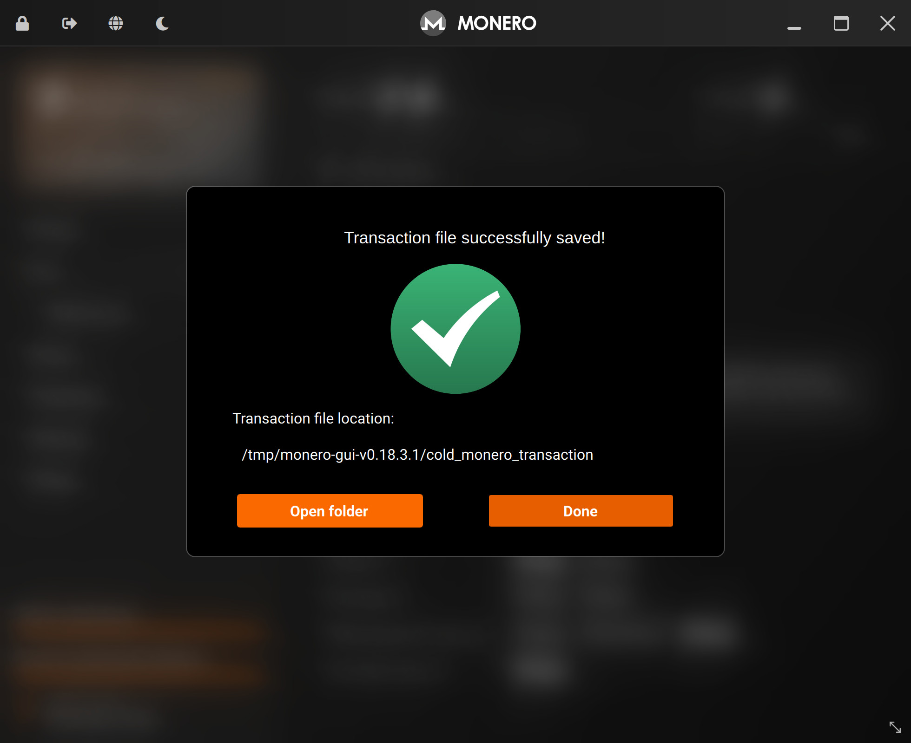

# Create a transaction
From your `view-only` wallet, you can send Monero like normal, but instead of `Send ->`, you'll be using the `Offline transaction signing` feature.

---

Goto:
- `Send` tab
- Advanced options
- Offline transaction signing
- Click `Submit`

This will not send funds, as this `view-only` wallet is not allowed to do that.

It will however, create a unsigned transaction file - a file that only needs your cold wallet's signature to be ready to go.

Confirm the amount you're sending, who you're sending to and `Save as file` (you may be responsible for naming of the file and where it is saved).

Take note of where this file is saved.

Transfer this unsigned transaction file to your data transfer medium (USB, SD Card, etc).

We're now ready to [`Sign the transaction`](./sign_the_transaction.md).

