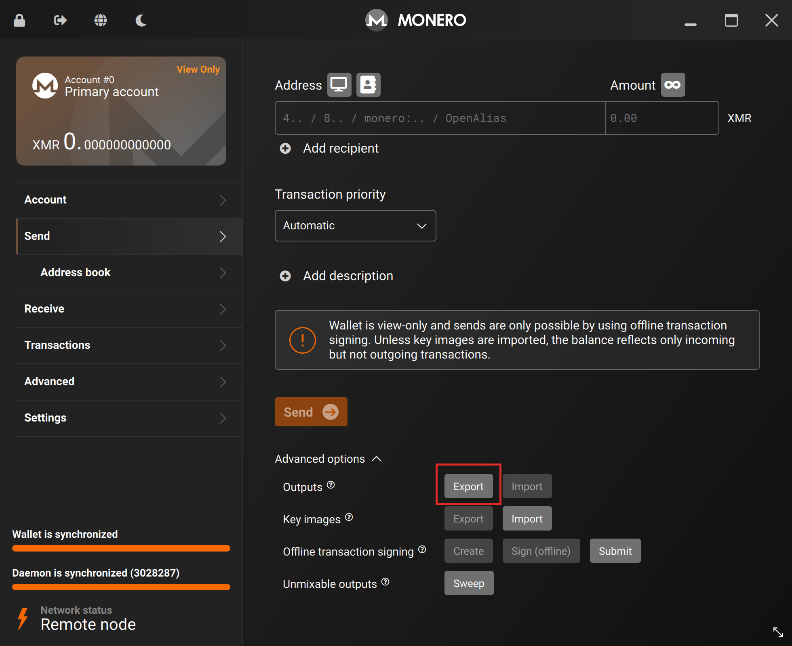
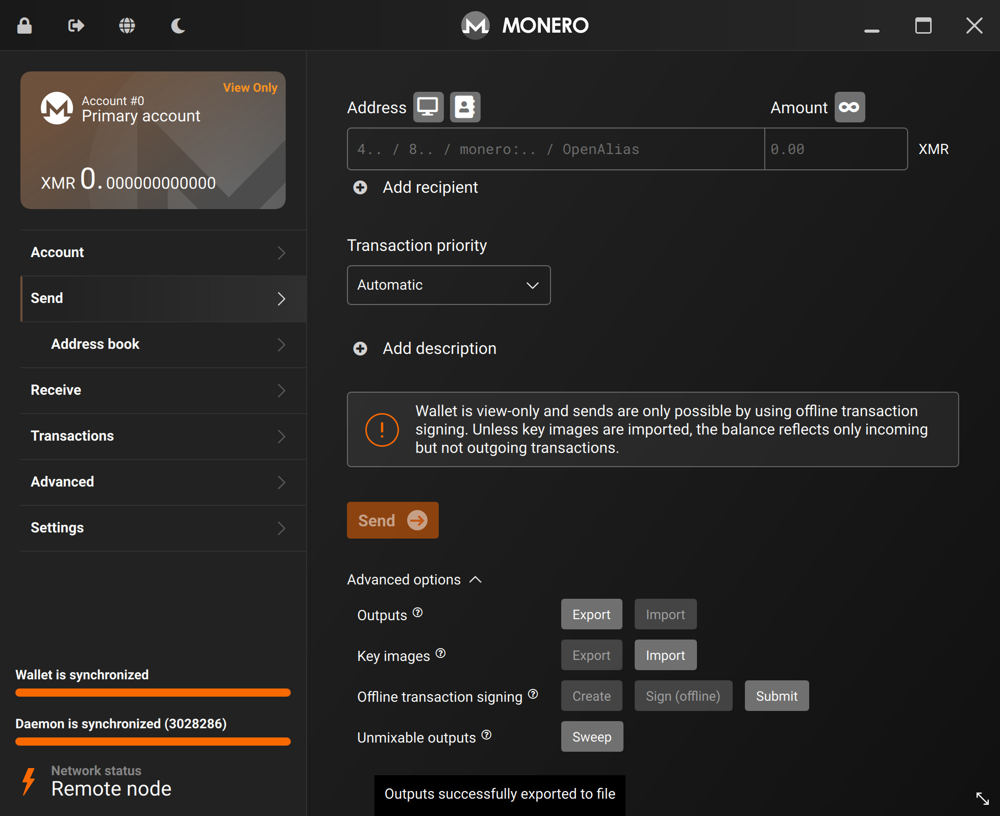
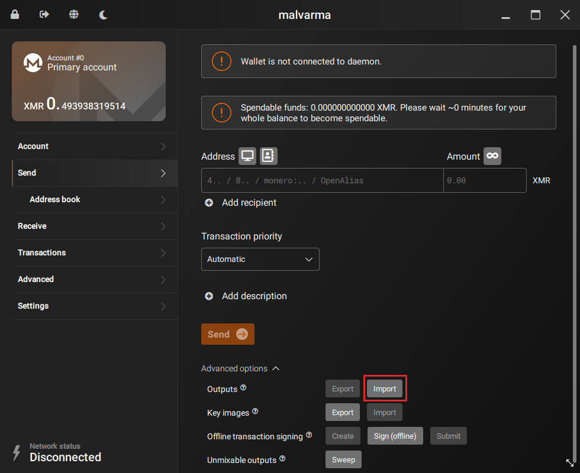

# Outputs
Your cold wallet is not connected to any network, so it cannot update its current balance automatically.

However, your `view-only` wallet at this point in the guide _does_ know the true balance.

We'll be transferring the `outputs` file from our `view-only` wallet -> to our cold wallet.

This will update the cold wallet so that it knows how much Monero it actually has.

**This is a required step** - your cold wallet requires this information.

---

In your `view-only` wallet, goto:
- `Send` tab
- Advanced options
- Outputs
- Click `Export`

The output file will be saved in your location of choice.

You can save it directly to your data transfer medium (USB, SD Card, etc).

On the cold wallet, plug-in your data transfer medium, and goto:
- `Send` tab
- Advanced options
- Outputs
- Click `Import`

Here, select the output file you created in the last step.

After this is done, your cold wallet's balance will be updated and will be able to sign future transactions.

Consider deleting all the non-wallet files created up until this point (transaction, signed, key image, output) as they are no longer required.

## End?

This is the end of the main part of the guide - everything beyond this is technically optional, although it's recommended to continue reading.
