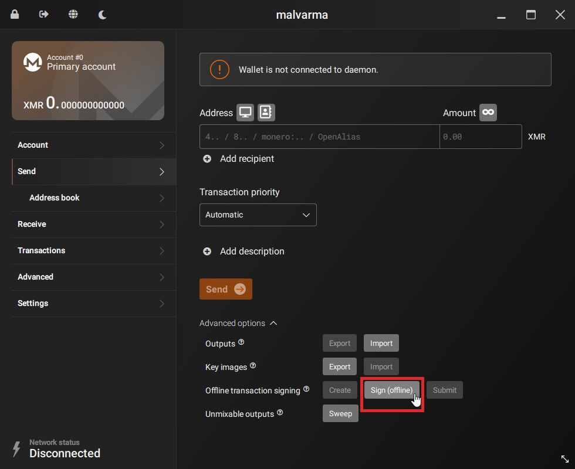
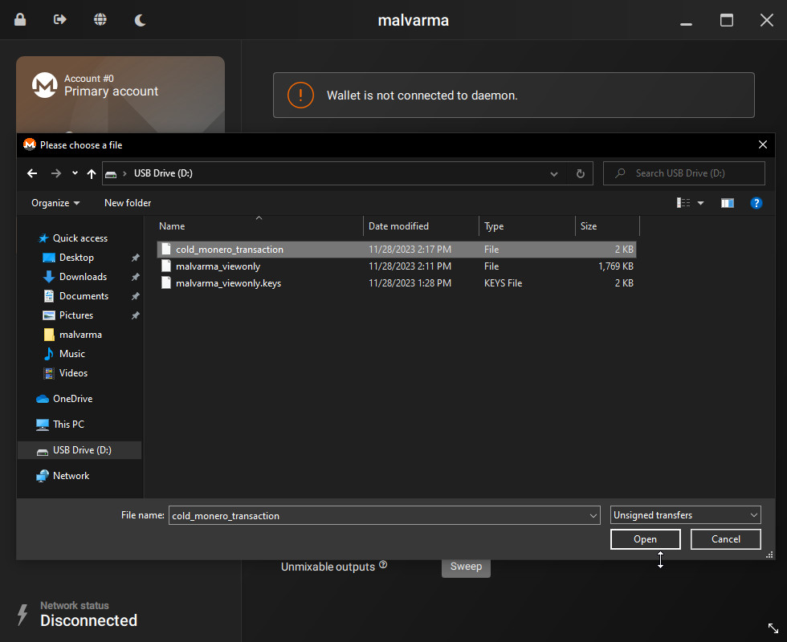
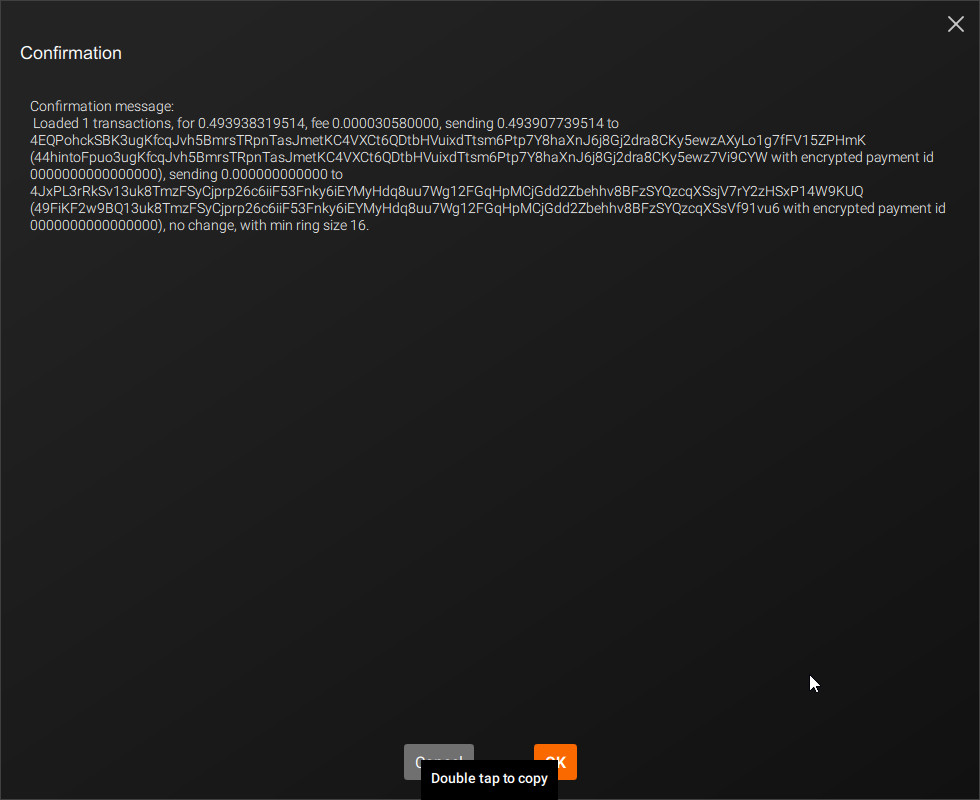
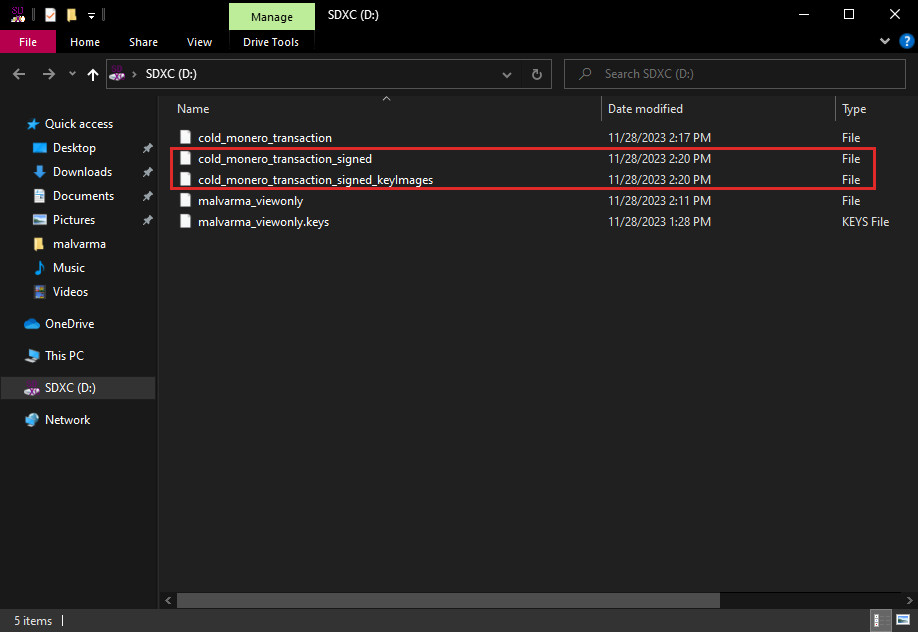

# Sign the transaction
We'll be signing (authorizing) the transaction created in the previous step.

---
We're now back on the cold device.

After plugging in your data transfer medium (USB, SD Card, etc) into your cold device, goto:
- `Send` tab
- Advanced options
- Offline transaction signing
- Click `Sign (offline)`

Select the transaction file created in the last step.

In this example, the file is named `cold_monero_transaction` but in your case, it will be whatever you named it.

Confirm the details of this transaction.

There may be unknown addresses shown due to [stealth addresses](https://www.getmonero.org/resources/moneropedia/stealthaddress.html) and [change addresses](https://www.getmonero.org/resources/moneropedia/change.html) but the address you are sending to should be specified.

In our case, we are indeed sending `0.49 XMR` to `44hinto...7Vi9CTW`.

After signing (authorizing) the transaction, there will be `_signed` and `_signed_keyImages` versions of your transaction file.

The `_signed` file is a "ready-to-go" transaction that can be broadcasted and successfully accepted by the Monero network, like a signed check with a name and amount.

Copy both of these to your data transfer medium (USB, SD Card, etc) and move onto the next step, [`Broadcast the transaction`](./broadcast_the_transaction.md).

